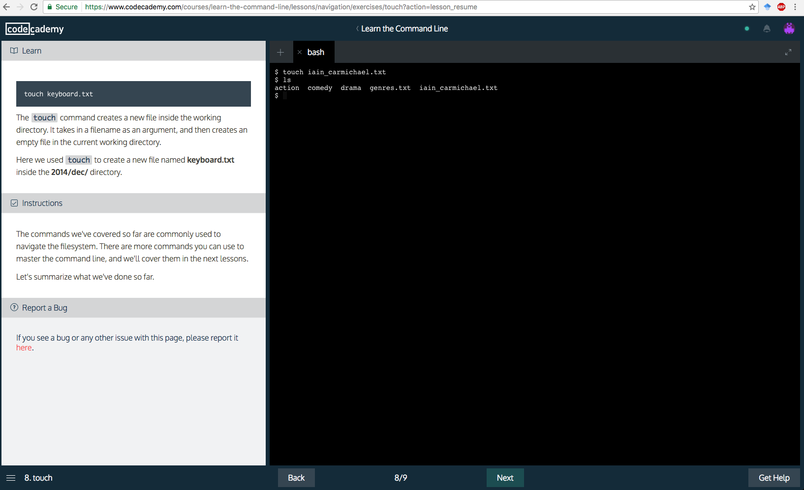

Go through [this Code Academy tutorial on the command line](https://www.codecademy.com/en/courses/learn-the-command-line/lessons/navigation/exercises/your-first-command?action=lesson_resume). On the 8th screen make a new file with your name i.e. `touch iain_carmichael.txt`. Take a screen shot of this and submit it on Sakai i.e.

