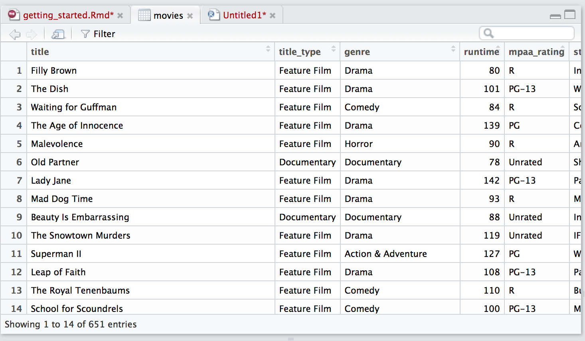

# Install R

**Download the latest version of R from the [Comprehensive R Archive Network](https://cran.rstudio.com/)** (CRAN). [R](https://www.r-project.org/about.html) is a programming language built for statistical analysis.

# Install R Studio

**Download [R Studio](https://www.rstudio.com/products/rstudio/#Desktop)** which is an [IDE](https://en.wikipedia.org/wiki/Integrated_development_environment) built for R. While you can use R without R Studio, R Studio makes life much better.


Watch the [video on this page](https://www.rstudio.com/products/RStudio/) for the basics parts of R Studio

# Basic R commands
You downloaded [base R](https://www.rstudio.com/wp-content/uploads/2016/05/base-r.pdf) from CRAN.

Run the following in your R console
```{r 11}
1 + 1
```

```{r var}
a <- 1
b <- 2
a + b
```

# Packages
The power of R comes from the many wonderful R packages people develope. R is an [open source](https://en.wikipedia.org/wiki/Open-source_software) language meaning anyone can develope a new R package. 

You can install a package from [CRAN](https://cran.r-project.org/) like this
```{r install, eval=FALSE}
install.packages("tidyverse")
```

There are other sources of R packags such as [Bioconductor](http://www.bioconductor.org/) and [Github](https://github.com/). Packages from CRAN and Bioconductor are vetted (though not perfectly). Packages on Github are not.

To use code from an R package you need to load it
```{r loadpackage}
# ignore the warnings for now
library(tidyverse)
```
You need to load an R package everytime you want to use it. You only need to install it once.

# IMBD
Load the [movies data set](http://www2.stat.duke.edu/~mc301/data/movies.html) generously currated by [Mine Cetinkaya-Rundel](http://www2.stat.duke.edu/~mc301/)
```{r load movies}
# downloads data set and loads it into R
load(url('https://stat.duke.edu/~mc301/data/movies.Rdata'))
```


The first thing you should do when you get a data set is [look at it](https://www.youtube.com/watch?v=EF8GhC-T_Mo). 

## numerical summaries

`str()` tells you about the data frame. First thing to note is the dimension of the data frame (651 rows by 32 columns)and the column types
```{r str}
str(movies)
```

`head()` prints the first six rows of a data set (and as many columns that will fit on the screen)
```{r head}
head(movies)
```


If you double click a data frame it will pull up R's built in spreadsheet


`summary()` prints out some descriptive statistics of each column
```{r summ}
summary(movies)
```

The `$` sign after a data frame will return a column
```{r col}
movies$imdb_num_votes
```

The `mean()` function computes the mean of a vector. There is also a `median`, `var`, `min`, `max`

```{r mean}
mean(movies$imdb_num_votes)
```


## Vizualization
You can only learn so much by looking lists of numbers. Let's make some plots.

There are two popular plotting systmes in R. There is the *base* R system

```{r base_plot}
plot(movies$imdb_rating, movies$critics_score)
```

and [ggplot2](http://ggplot2.org/).

```{r ggplot}
# ggplot was loaded with tidyverse
ggplot(data = movies) + geom_point(mapping = aes(x = imdb_rating, y = critics_score))
```

We will use ggplot2 in this course (see readings below about ggplot2 vs base). ggplot2 can be a bit intimidating at first -- especially if you are used to base plotting. 

```{r hist, warning=FALSE}
ggplot(data=movies, aes(x=audience_score)) + geom_histogram()
```

ggplot2 has a ton of functionality built it and you will learn to love it when you get used to it.

```{r byrating, warning=FALSE}
ggplot(data = movies) + geom_point(mapping = aes(x = imdb_rating, y = critics_score, color=mpaa_rating))
```

# Getting help
The main textbook for this class is [R for Data Science](http://r4ds.had.co.nz/data-visualisation.html) written by Hadley Whickham (it's free online). I have put up a [long list of alternative resources](https://idc9.github.io/stor390/course_info/references.html) (textbooks, coursera courses, etc). 

Google and [StackOverflow](http://stackoverflow.com/) will become your best friends. If you have a question, chances are someone has already asked and answered it. If R gives you an error message you don't understand google it -- someone else has probably figured it out and posted it online.

The course staff is of course here to help you. If you get stuck on something **spend at least 5 minutes Googling/hacking at it**. There is a good chance the first thing one of us will do is turn to google. **Don't spend more than 20 minutes stuck on one thing** -- at this point you should as for help.

# [Yak Shaving](https://en.wiktionary.org/wiki/yak_shaving)

 > Any apparently useless activity which, by allowing you to overcome intermediate difficulties, allows you to solve a larger problem. 
 
 *I was doing a bit of yak shaving this morning, and it looks like it might have paid off.*

Programming/data science requires a lot of yak shaving which can be quite frustrating. You will probably come across the following quote at some point

> 80 percent of data science is data cleaning

# Literate programming and R Markdown

[Literate Programming](https://en.wikipedia.org/wiki/Literate_programming) is a concept intoduced by Donal Kunth saying you should *write code that communicates primarily to hummans, not computers*. [R Markdown](http://rmarkdown.rstudio.com/) allows you easily write documents that contain: R code, text, images, links, etc. It may sounds bland at first R Markdown [is pretty amazing](http://rmarkdown.rstudio.com/gallery.html). All of my lecture notes are done in R Markdown. 

Open a new R Markdown document and play around with it. We will use R Markdown quite a bit in the class. You can read more [about R Markdown in r4ds](http://r4ds.had.co.nz/r-markdown.html#r-markdown-basics). 


# Reading
- read the secions 1, 2, 3.1-3.5 of [r4ds](http://r4ds.had.co.nz/introduction.html)
- read Jenny Bryan's tutorial on the [R workspace](http://stat545.com/block002_hello-r-workspace-wd-project.html)
- [Data science done well looks easy - and that is a big problem for data scientists](http://simplystatistics.org/2015/03/17/data-science-done-well-looks-easy-and-that-is-a-big-problem-for-data-scientists/)


# Additional references

- [R Markdown basics](http://r4ds.had.co.nz/r-markdown.html#r-markdown-basics)

- ggplot2 vs. base plotting
    - [Why I don't use ggplot2](http://simplystatistics.org/2016/02/11/why-i-dont-use-ggplot2/)
    - [Why I use ggplot2](http://varianceexplained.org/r/why-I-use-ggplot2/)

- Data cleaning in the New York Times
  - [For Big-Data Scientists, ‘Janitor Work’ Is Key Hurdle to Insights](https://www.nytimes.com/2014/08/18/technology/for-big-data-scientists-hurdle-to-insights-is-janitor-work.html)
  - and David Mimno's response [Data Carpentry](http://www.mimno.org/articles/carpentry/)
  
- 