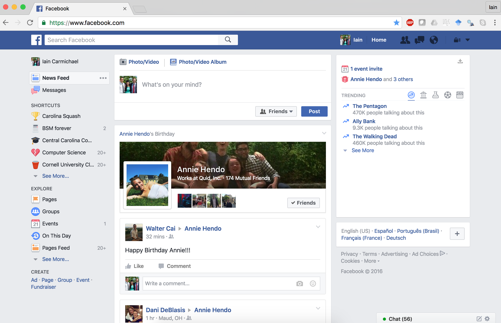
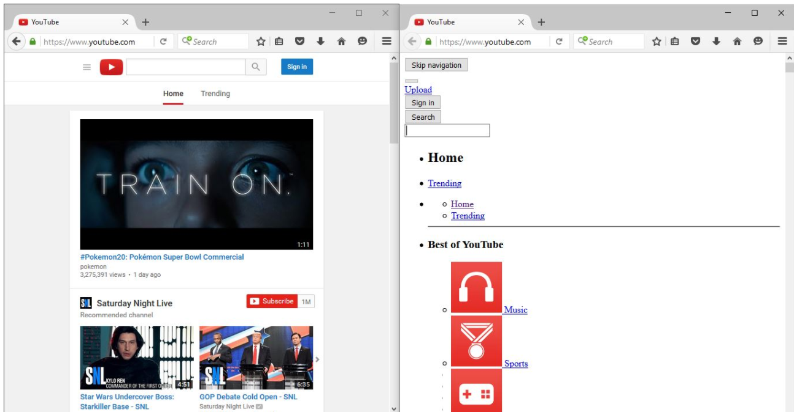
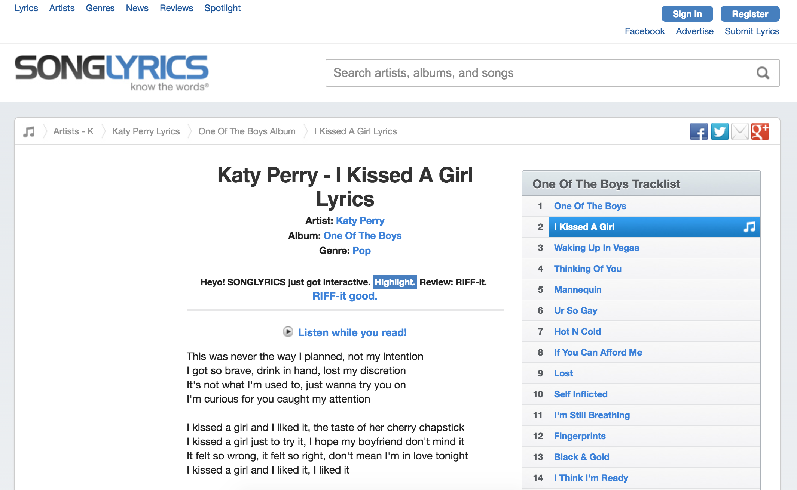
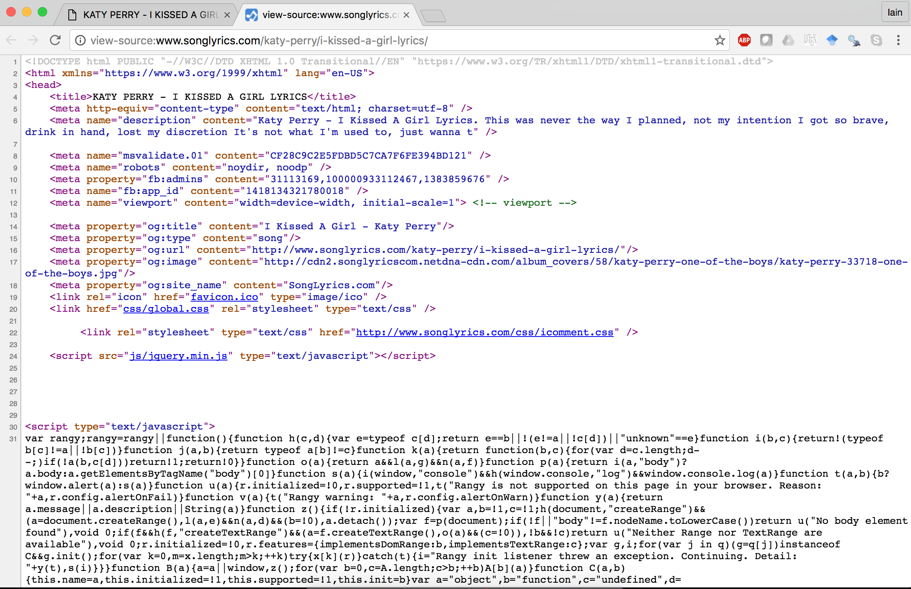
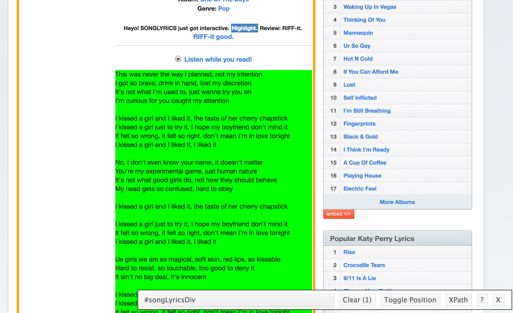
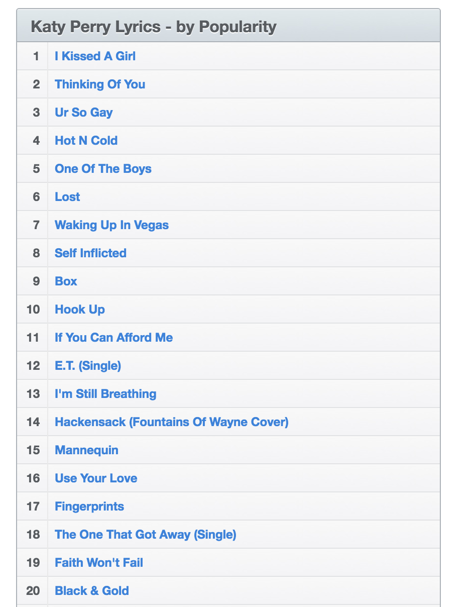

This lecture covers web scraping with the [`rvest`](https://github.com/hadley/rvest) package and [SelectorGaget](http://selectorgadget.com/).

Say you've decided you want the lyrics to every Katy Perry song. There are many websites that have song lyrics (e.g. [www.songlyrics.com](www.songlyrics.com)), but how do you get these lyrics onto your computer and into a useable format without spending the next three days copying and pasting?

# **Prerequisites**

Before reading further watch [**this 2 minute video about SelectorGaget**](http://selectorgadget.com/) and 

```{r load_libraries, message=FALSE}
# library for webscraping
library(rvest)

library(tidyverse)
library(stringr)
```

Download the [selectorgaget chrome extension](https://chrome.google.com/webstore/detail/selectorgadget/mhjhnkcfbdhnjickkkdbjoemdmbfginb) (note you may need google chrome). 

This lecture assumes you are familiar with regular expressions and the tidyverse (tibble data frames and the pipe operator)


# **The web: HTML and CSS**
Most of the web is built out of: [HTML](https://en.wikipedia.org/wiki/HTML), [CSS](https://en.wikipedia.org/wiki/Cascading_Style_Sheets) and [JavaScript](https://en.wikipedia.org/wiki/JavaScript). When you visit a webpage your computer sends a [request](https://en.wikipedia.org/wiki/Hypertext_Transfer_Protocol) to a [web server](https://en.wikipedia.org/wiki/Web_server) which returns a bunch of text in the form of HTML. Your browser then renders that HTML text into the webpage that you see. You can actually view the HTML code (in Chrome: View > Developer > View Source), for example

<div style="width:800px; height=800px">
Webpage (HBD Annie!)  |  Raw html
:--------------------:|:-------------------:
           |  
</div>


[HTML](https://en.wikipedia.org/wiki/HTML) stands for **H**yper**T**ext **M**arkup **L**anguage. HTML deals with links and basic formatting. Hypertext is text that links to another webpage. A markup language displays text with formatting (e.g. **bold**, *italics* ~~strikethrough~~, etc)  and turns text into images, tables, etc. R Mardown uses [markdown](https://en.wikipedia.org/wiki/Markdown) with is a lightweight mark up language.

[CSS](https://en.wikipedia.org/wiki/Cascading_Style_Sheets) stands for Cascading Style Sheets and is what makes webpages pretty. CSS allows for [separation of presentation and content](https://en.wikipedia.org/wiki/Separation_of_presentation_and_content)

<div style="width:400px; height=600px">

</div>


To learn more about HTML check out [Code Academy's tutorial](https://www.codecademy.com/courses/web-beginner-en-HZA3b/0/1).

For our purposes we only need to understand enough HTML to access its contents (Iain knows more Katy Perry lyrics than HTML code...). With `rvest` and SelectorGaget we don't need to know too much to do many basic tasks. It's worth learning more so you can a) do more advanced scraping b) create your own websites. 

An HTML document is make up of a hierachy of [tags](https://en.wikipedia.org/wiki/HTML#Markup). The first division in the hierarchy is the *head* and the *body*. The head contains metadata about the webpage and the body contains the contents. The A tag identifies a hyper link. For example, 

> < a href="http://www.songlyrics.com/katy-perry/i-kissed-a-girl-lyrics/" title="I Kissed A Girl Lyrics Katy Perry">I Kissed A Girl</a>

displays a link to http://www.songlyrics.com/katy-perry/i-kissed-a-girl-lyrics/ with text [I Kissed A Girl](http://www.songlyrics.com/katy-perry/i-kissed-a-girl-lyrics/). 


An HTML document is just a text file that follows specific patterns. Once you have the html text you could excract the information you want using regular expressions. This is doable, but a pain. Thanks to the open source community you don't have to. We will use the `rvest` package. This is similar to the [BeautifulSoup](https://www.crummy.com/software/BeautifulSoup/) package in Python.

# **Scrape HTML**

Let's take a look at the lyrics of  [I Kissed a Girl](https://www.youtube.com/watch?v=tAp9BKosZXs) from  [**http://www.songlyrics.com/katy-perry/i-kissed-a-girl-lyrics/**](http://www.songlyrics.com/katy-perry/i-kissed-a-girl-lyrics/)

<div style="width:800px; height=800px">
Webpage                    |  Raw html
:-------------------------:|:-------------------:
 |  
</div>

Using `rvest` we can easily grab the html from this page

```{r}
song_url <- 'http://www.songlyrics.com/katy-perry/i-kissed-a-girl-lyrics/'

html <- read_html(song_url)  # from rvest
html
```

Notice the first division in the html object is the `<head>` and `<body>`.


# **Grab the lyrics from one song**

SelectorGaget identifies `#songLyricsDiv` as the CSS tag corresponding to just the song lyrics. Note you may have to click on a few things to find the exact tag you are looking for. Be aware that SelectorGaget will not always work perfectly.


<div style="width:400px; height=600px">

</div>

Now we can grab the lyric text

```{r}

lyrics <- html %>%
           html_nodes("#songLyricsDiv") %>%
           html_text()
lyrics
```


The `html_nodes` function grabs the node corresponding to the `#songLyricsDiv` tag; `html_text` extracts the text from this node.

# **Scrape every Katy Perry song**

Now we would like to scape the lyrics to every Katy Perry song. For our purposes "every Katy Perry song" means "every Katy Perry song *listed on song lyrics*". You should always be aware of data quality issues; songs might be missing, mislabeled, or duplicated. 

Song lyrics lists 91 Katy Perry songs at [http://www.songlyrics.com/katy-perry-lyrics/](http://www.songlyrics.com/katy-perry-lyrics/).


<div style="width:400px; height=600px">

</div>

Note that [Last Friday Night](https://www.youtube.com/watch?v=KlyXNRrsk4A) is listed four times under: 

- Last Friday Night (T.G.I.F.) (Single)
- Last Friday Night (T.G.I.F.) (Missy Elliott Remix)
- Last Friday Night (T.G.I.F.)
- Last Friday Night (T.G.I.F.) (featuring Missy Elliott Remix)

We could get rid of some duplicates if we were so inclined using some combination of heuristic deduplication rules (e.g. flag every song whose title contains another song's title) and manual inspection.

## Get all song titles
Using SelectorGaget again we find `#colone-container .tracklist a` is CSS tag for all of the song names.


```{r}
artist_url <- 'http://www.songlyrics.com/katy-perry-lyrics/'

song_nodes <- read_html(artist_url) %>% # load the html
             html_nodes("#colone-container .tracklist a")

song_nodes[1:3]
```


Notice the pattern of the artist_url: http://www.songlyrics.com/ARTIST-lyrics/ where ARTIST is the artist's name in lower case with spaces replaced by -.

Now we have the nodes for each song we want to extract the song title

```{r}
# grab the song titles
song_titles <-  html_text(song_nodes)
song_titles[1:3]
```

and the url to the song's webpage.
```{r}
# grab the song titles
song_links <-  html_attr(song_nodes, name='href')
song_links[1:3]
```

Now we have all the pieces we need to scrape the lyrics to every Katy Perry song with the below for loop.


# **Warning**

Websites often don't like it when you scrape too much of their data and you can get banned from a website if you submit requests too frequently. Typically you (really your IP address) will be banned for 24 hours. Website vary in their permisivness and vengefullness; rumor on the street is that you can get yourself [kicked off Facebook for attempting to scrape it improperly](https://www.quora.com/What-is-the-best-way-to-scrape-Facebook-data). 

A common solution is to have the computer pause between requests (I used 10 second pauses for songlyrics). Websites don't care about you viewing some of their data -- they care about you downloading a lot of it in one fell swoop (think ad views and competitors). Figuring out an accepatble pause time can take some trial and error.

The pauses make this process slow (5 seconds * 90 songs ~= 8 minutes). If you want to download a lot of songs you will have to wait a while (you can get about 7000 songs over night). APIs and bulk downloads can make this process much faster (see below).


# **Putting it together: scape all KP lyrics**

From the above code we can

- get a list of Katy Perry songs
- scrape the lyrics of an individual song

We can put this together to scrape the lyrics of every Katy Perry song on songlyrics.

```{r}

# data frame to store 
lyrics <- tibble()
for(i in 1:length(song_links[1:2])){ # only grab 3 songs in the .rmd document
    
    # always nice to know where a long program is
    message(str_c('scraping song ', i, ' of ', length(song_links) ))
    
    # scape the text of a song
    lyrics_scraped <- song_links[i] %>%
                      read_html() %>% 
                      html_nodes("#songLyricsDiv") %>%
                      html_text()
    

    # format the song name for the data frame
    song_name <- song_titles[i] %>% 
                 str_to_lower() %>% 
                 gsub("[^[:alnum:] ]", "", .) %>%
                 gsub("[[:space:]]", "_", .)

    # add song to lyrics data frame
    lyrics <- rbind(lyrics, tibble(text=lyrics_scraped, artist = 'katy_perry', song=song_name) )
   
    # pause so we don't get banned!
    Sys.sleep(10) 
}
lyrics
```

You should include a [try-catch](http://mazamascience.com/WorkingWithData/?p=912) statment around the `lyrics_scraped` expression so that the scaper doesn't stop if it fails to scrape a couple pages.


Mission accomplished -- we have scraped the lyrics to every Katy Perry song. Ideally you would implement the above code as a function that takes an artist's name as input and returns the song lyrics to all of their songs. Thanks to `rvest` and SelectorGaget it's pretty easy to generalize this code to other websites.

# **References**

The following are good references for using `rvest`

- [Web scraping/processing with rvest and stringr](DR_wrangling.html) (Amazon reviews)

- [scraping wikipedia](https://rpubs.com/superseer/rvest)

- [scraping imdb](https://stat4701.github.io/edav/2015/04/02/rvest_tutorial/)

- [SelectorGaget vignette](https://cran.r-project.org/web/packages/rvest/vignettes/selectorgadget.html)

## HTML references

- [html.com/](http://html.com/)

- [Code Academy's tutorial](https://www.codecademy.com/courses/web-beginner-en-HZA3b/0/1)


## Getting data from the web

- [Jenny Bryan's class](http://stat545.com/webdata03_activity.html#scraping-via-css-selectors) has a section on web scraping

- [Using Python to Access Web Data](https://www.coursera.org/learn/python-network-data) on Coursera covers webscraping in more detail. Altough it's in Python the lessons still apply.


## Other ways to get song lyrics data

- Most of the lyrics from the [Million Song Dataset](http://labrosa.ee.columbia.edu/millionsong/) are available for [download here](http://labrosa.ee.columbia.edu/millionsong/musixmatch).


- [MusixXmatch](https://developer.musixmatch.com/) has an API where you can get 2000 song lyrics a day for free (it's $25,000/year for more).

- [gennius.com](http://genius.com/) also has an API.
