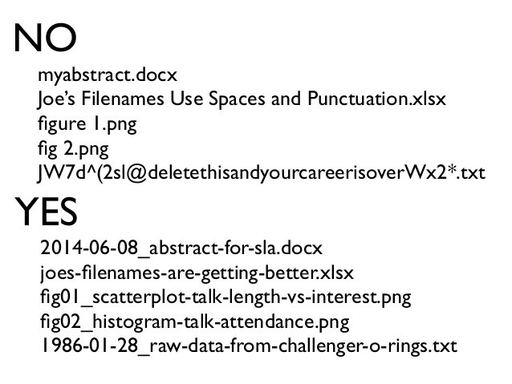

Most of the code you write will be in R scripts. Sometimes the console is useful to quickly run lines of code, but you should generally default to an R script since the code is then saved. For presenting results you should transfer your code to R Markdown. 

Data science projects usually require understanding how the files/folders are organized on your computer. Go into your `Documents` folder and create a new folder titled `stor390`.

## The command line

The command line is an important tool for data science, especially when you start working with data a lot or want to use a cluster/cloud computing. See [Data Science at the Command Line](http://datascienceatthecommandline.com/) for more details.

On a mac you will use [Termial](https://en.wikipedia.org/wiki/Terminal_(macOS)) you use [Command Prompt](https://www.lifewire.com/command-prompt-2625840). The basic functionality is the same, but many of the basic commands (annoyingly) have different names. 

This [page translates between Windows commands and Unix commnands](https://www.lemoda.net/windows/windows2unix/windows2unix.html). I have a mac so I will use Unix commands.

### basic commands

There are only a few commands you need to know right now which navigate around the computer. 

The basic **Unix** commands are

`cd`: move around the computer (change directory)

`pwd`: print the current working directory

`ls`: list the files/folders in the current directory

`mkdir`: make a new folder


The corresponding **Windows** commands are

`cd`: move around the computer (change directory)

`cd`: print the current working directory (yes `cd` does both)

`dir`: list the files/folders in the current directory

`mkdir`: make a new folder

### In class exercise: the command line
Do this [tutorial in class](https://idc9.github.io/stor390/class_exercises/command_line/command_line.html) from Code Academy.

Now use the command line to make a new folder named `movies` in the `stor390` folder you just created.


## R Studio

The environment stores all the data you are currently working with. You should frequently clear the environment to make sure your code is doing what you think it is doing.

There are a few R Studio defaults you should change (see [Customizing RStudio](https://support.rstudio.com/hc/en-us/articles/200549016-Customizing-RStudio) for more details. Under General R Options change from default

- do not restore .RData into workspace at startup
- do not save workspace to .RData on exit

This will help force you to write reproducible code and prevent a lot of pain in the future.


Under code

- set tab width to 4 spaces (there is no other reasonable number of spaces...)

## working directory
The working is the folder in your computer R looks for anything you ask it to load (e.g. data sets, other R scripts). 

Type `getwd()` to see your current working directory. There is a default working directory (usually your home folder). If you open R Studio by clicking on a script then the working directory will be the folder where that script is located. R Markdown will use the folder the .Rmd file is saved in as the working directory. 

You can change the working directory with the `setwd()` command.

```{r setwd, eval=FALSE}
setwd("/Users/iaincarmichael/Dropbox/stor390/example_code/workflow")
```
This may be useful at some point, but you should **not** set the working directory manually like this. Instead you should use R Projects...

## R Projects
Each time you work on a new project create a new folder (top left of R Studio). You can read about R Projects in section 8 of r4ds. One great thing about R Projects is they automatically set your current working directory.

## naming convention
There are three common used naming conventions for naming files and variables (see r4ds section 4.2).

```{r name, eval=FALSE}
i_use_snake_case
otherPeopleUseCamelCase
some.people.use.periods
```

You are welcome to use any of these (I prefer snake case for most things). It is important to not use spaces or punctuation in your names.




## Reproducibility 

Reproducibility is an important concept in data science and will make in appearance in different ways in this course. One of the basic tenets of reproducibility is: your code should run on someone else's computer, give the same result and do so with minimal effort on their part. This may sound trivial, but often fails to occur in practice and can cause huge headaches.

Someone else should be able to run your R script on their computer without changing anything. All you should have to do

- save the R script and data set in the same directory
- set that directory as the working directory (i.e. by making an R Projects)
    - read the data in with `data <- read_csv('data.csv')`


# If you have used R but not the tidyverse

For this class we will use packages from the tidyverse (which you can [read more about here](http://tidyverse.org/) or [here](https://blog.rstudio.org/2016/09/15/tidyverse-1-0-0/)). The primary differences from base R are:

- ggplot2 vs. base plotting
- read_csv vs. read.csv
- tibble vs. data frame
    - [read about tibbles](https://github.com/tidyverse/tibble)
    - "Tibbles are data.frames with nicer behavior around printing, subsetting, and factor handling."


# References

- there are two useful ggplot2 references: [ggplot2 cheatsheet](https://www.rstudio.com/wp-content/uploads/2015/03/ggplot2-cheatsheet.pdf) and  [http://docs.ggplot2.org/current/](http://docs.ggplot2.org/current/)

- [Data Science at the Command Line](http://datascienceatthecommandline.com/)

- [Code Academy tutorial on the command line](https://www.codecademy.com/en/courses/learn-the-command-line/lessons/navigation/exercises/your-first-command?action=lesson_resume)

- [zen and the art of file and folder organization](http://www.howtogeek.com/howto/15677/zen-and-the-art-of-file-and-folder-organization/) 
